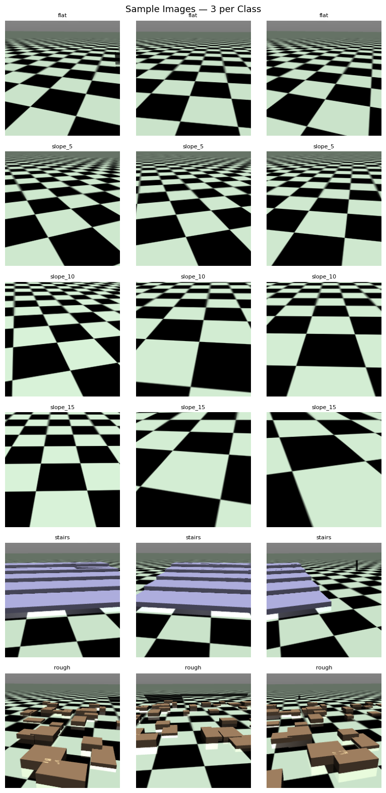
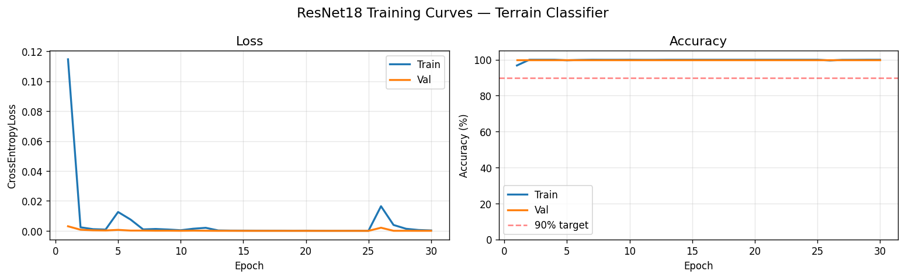
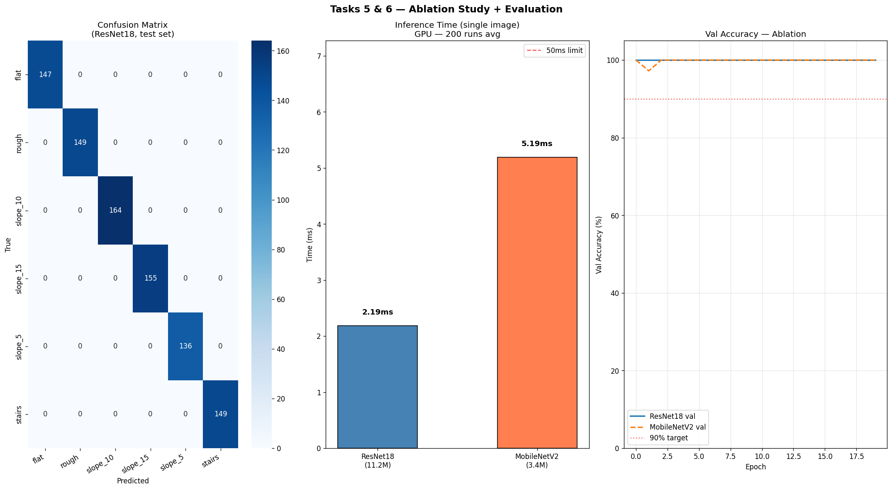
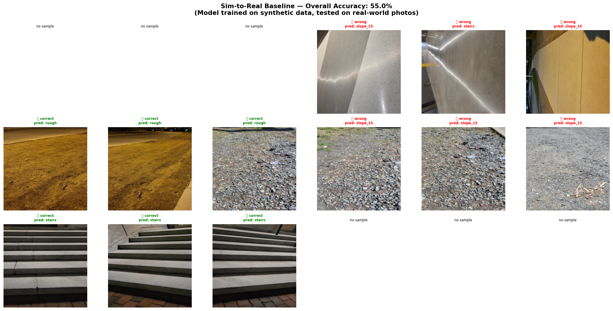
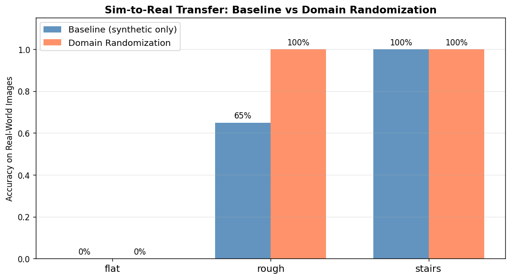
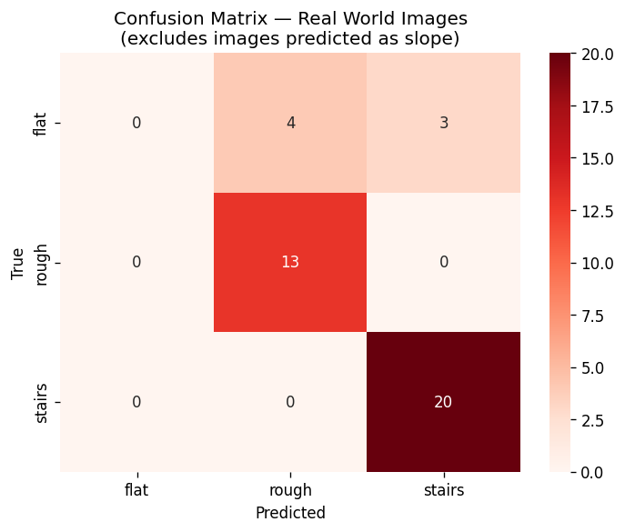
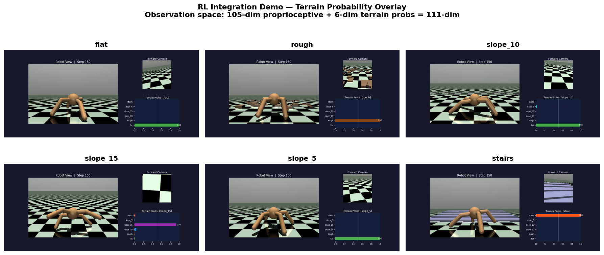

# 🤖 Terrain-Aware Visual Perception for Quadruped Robot Locomotion
### A Sim-to-Real Transfer Study

[](https://www.khoury.northeastern.edu/)
[](https://www.python.org/)
[](https://pytorch.org/)
[](https://gymnasium.farama.org/)
[](LICENSE)

> A vision-based terrain classification system that augments a simulated quadruped robot's observation space with forward-looking perceptual context, enabling terrain-aware locomotion via sim-to-real transfer.

---

## 📽️ Demo & Presentation

<div align="center">

| 🎬 Project Presentation | 🤖 Live Demo |
|:-:|:-:|
| [](https://drive.google.com/file/d/1pJpd2MHMN9tIR2uB2RxGzc1EypaJJdM8/view?usp=sharing) | [](https://drive.google.com/file/d/1hsozrdFPB-8JqO-9RwAp9CrFr9qqQEVX/view?usp=sharing) |

</div>

---

## 📋 Table of Contents

- [Overview](#overview)
- [Key Results](#key-results)
- [System Architecture](#system-architecture)
- [Dataset](#dataset)
- [Models](#models)
- [Sim-to-Real Transfer](#sim-to-real-transfer)
- [RL Integration](#rl-integration)
- [Results Gallery](#results-gallery)
- [Installation](#installation)
- [Usage](#usage)
- [Project Structure](#project-structure)
- [References](#references)

---

## 🔍 Overview

Legged robots trained with reinforcement learning typically rely solely on **proprioceptive feedback** (joint angles, velocities, contact forces), leaving them unable to anticipate terrain changes ahead. This project develops a CNN-based terrain classifier that:

- Generates a **6,000-image synthetic dataset** across 6 terrain classes using MuJoCo simulation
- Achieves **100% accuracy** on synthetic test data via ResNet18 transfer learning
- Evaluates **sim-to-real transfer** on 60 real-world photographs
- Demonstrates that **domain randomization** improves real-world accuracy from 55% → 66.7%
- Integrates terrain probabilities as a **6-dimensional extension** to the robot's 105-dim proprioceptive observation space (→ 111-dim total)

---

## 🏆 Key Results

| Metric | Value |
|---|---|
| Synthetic Test Accuracy (ResNet18) | **100%** |
| Synthetic Test Accuracy (MobileNetV2) | **99.9%** |
| Sim-to-Real Baseline Accuracy | **55.0%** |
| Sim-to-Real with Domain Randomization | **66.7%** |
| ResNet18 GPU Inference Time | **2.19 ms** |
| MobileNetV2 GPU Inference Time | 5.19 ms |
| Observation Space Augmentation | 105-dim → **111-dim** |

### Per-Class Sim-to-Real Transfer

| Class | Baseline | Domain Randomization | Change |
|---|---|---|---|
| Flat | 0.0% | 0.0% | — |
| Rough | 65.0% | **100.0%** | +35% ✅ |
| Stairs | **100.0%** | **100.0%** | — ✅ |
| **Overall** | **55.0%** | **66.7%** | **+11.7%** |

---

## 🏗️ System Architecture

```
MuJoCo Simulation
       │
       ▼
Forward Camera (224×224 RGB)
       │
       ▼
ResNet18 Classifier (Transfer Learning)
       │
       ▼
6-dim Terrain Probability Vector
[flat, rough, stairs, slope_5, slope_10, slope_15]
       │
       ▼
Concatenate with 105-dim Proprioceptive State
       │
       ▼
111-dim Augmented Observation → RL Policy
```

---

## 📦 Dataset

The dataset is generated procedurally using the **MuJoCo Ant-v5** quadruped with a forward-facing camera mounted at position `(0, 0.5, 0.5)`, tilted 20° downward.

### Terrain Classes (6 total)

| Class | Description |
|---|---|
| `flat` | Default flat plane |
| `slope_5` | 5° inclined plane |
| `slope_10` | 10° inclined plane |
| `slope_15` | 15° inclined plane |
| `stairs` | 5 stacked box geoms (0.1m rise, 0.8m depth) |
| `rough` | 45 randomly placed box obstacles |

### Dataset Statistics

- **Total images:** 6,000 (1,000 per class)
- **Resolution:** 224 × 224 RGB
- **Split:** 70% train / 15% val / 15% test (4,200 / 900 / 900)
- **Viewpoint diversity:** Position ±2m lateral, ±1.5m forward; yaw ±25°

**Sample dataset images:**

<div align="center">
  
</div>

---

## 🧠 Models

Both architectures are fine-tuned from **ImageNet pretrained weights** using:
- **Optimizer:** Adam (`lr=1e-4`, `weight_decay=1e-4`)
- **Scheduler:** ReduceLROnPlateau (`patience=5`, `factor=0.5`)
- **Training augmentation:** Random flip, rotation ±15°, color jitter

### ResNet18
- **Parameters:** 11.2M
- Final FC replaced: 512 → 6 classes
- Full end-to-end fine-tuning
- GPU inference: **2.19ms** ✅

### MobileNetV2
- **Parameters:** 3.4M
- Classifier head replaced: 1,280 → 6 classes
- GPU inference: 5.19ms

> **Counterintuitive finding:** ResNet18 is *faster* than MobileNetV2 on GPU despite having 5× more parameters. MobileNetV2's depthwise separable convolutions are optimized for CPU/edge deployment, while ResNet18's standard convolutions exploit GPU parallelism more effectively.

**Training curves:**



**Ablation study (confusion matrix + inference time):**



---

## 🌍 Sim-to-Real Transfer

### Baseline Evaluation

The synthetic-trained ResNet18 was evaluated on **60 personally captured photos** (20 per class: flat, rough, stairs) without any fine-tuning.

- Overall accuracy: **55.0%**
- Flat surfaces: **0%** — real flat surfaces (tile, marble, concrete) are visually unrelated to the synthetic green checkerboard
- 17/60 predictions were `slope_15` (perspective distortion in real photos resembles sloped synthetic terrain)



### Domain Randomization

Retrained with aggressive augmentation:
- Color jitter: brightness/contrast ±0.6, saturation ±0.5, hue ±0.1
- Random grayscale (p=0.15)
- Gaussian blur (σ ∈ [0.1, 2.0])
- Random perspective distortion (scale=0.3, p=0.5)

**Result:** 55.0% → **66.7%** overall accuracy; rough class: 65% → **100%** ✅

<div align="center">
  
</div>

**Confusion matrix (real-world images):**

<div align="center">
  
</div>

### Key Transfer Insights

| Finding | Explanation |
|---|---|
| Stairs transfer perfectly (100%) | Horizontal step edges are geometry-based, domain-invariant features |
| Rough improves with domain rand. | Color/texture jitter bridges the sim-to-real gap for obstacle-cluttered terrain |
| Flat fails completely (0%) | Fundamental texture mismatch; requires real training images to resolve |

---

## 🦾 RL Integration

The classifier is integrated via a `VisionEnhancedAnt` Gym wrapper:

```python
# At each timestep:
frame = forward_camera.render()           # 224×224 RGB
terrain_probs = classifier(frame)         # 6-dim probability vector
obs = concat(proprioceptive_obs, terrain_probs)  # 111-dim augmented state
action = policy(obs)
```

The classifier correctly identifies all 6 terrain types in simulation with high-confidence single-class predictions.



---

## 📸 Results Gallery

| Figure | Description |
|---|---|
| `results/dataset_samples.png` | Sample images from all 6 terrain classes |
| `results/training_curves_resnet18.png` | ResNet18 loss & accuracy over 30 epochs |
| `results/ablation_evaluation.png` | Confusion matrix, inference time, val accuracy curves |
| `results/simtoreal_baseline.png` | Correct/incorrect predictions on real-world photos |
| `results/simtoreal_comparison.png` | Per-class accuracy: baseline vs. domain randomization |
| `results/simtoreal_confusion.png` | Confusion matrix for real-world evaluation |
| `results/integration_summary.png` | RL integration terrain probability overlays |

---

## ⚙️ Installation

```bash
# Clone the repository
git clone https://github.com/YOUR_USERNAME/terrain-aware-locomotion.git
cd terrain-aware-locomotion

# Create a virtual environment
python -m venv venv
source venv/bin/activate  # or venv\Scripts\activate on Windows

# Install dependencies
pip install -r requirements.txt
```

### Requirements

```
torch>=2.0
torchvision>=0.15
gymnasium[mujoco]
mujoco>=2.3
numpy
Pillow
scikit-learn
matplotlib
seaborn
tqdm
```

## 📁 Project Structure

```
terrain-aware-locomotion/
├── PRCV_Final_Project_Terrain_Aware_Visual_Perception_for_Quadruped_Locomotion.ipynb   # Main Colab notebook (full pipeline)
├── data/
│   ├── synthetic/                 # Generated MuJoCo images (6 classes × 1,000)
│   └── real_world/                # 60 personally captured photos (3 classes × 20)
├── checkpoints/
│   ├── resnet18_best.pth
│   └── resnet18_domain_rand.pth
├── results/                       # All figures included in the paper
│   ├── dataset_samples.png
│   ├── training_curves_resnet18.png
│   ├── ablation_evaluation.png
│   ├── simtoreal_baseline.png
│   ├── simtoreal_comparison.png
│   ├── simtoreal_confusion.png
│   └── integration_summary.png
├── paper/
│   └── final_report.pdf
├── requirements.txt
└── README.md
```

---

## 🔮 Future Work

- **Mixed real-synthetic training** — even a small number of real flat images per class would disproportionately improve flat-surface accuracy
- **Grad-CAM visualization** — understand which image regions the classifier relies on for each terrain class
- **Depth image input** — RGB-D or pure depth may be more domain-invariant than RGB
- **End-to-end RL retraining** — retrain the full policy with the 111-dim vision-enhanced observation space and evaluate navigation success rate on mixed terrain

---

## 📄 Paper

The full IEEE-format paper is available in [`paper/final_report.pdf`](paper/final_report.pdf).

**Citation:**
```bibtex
@article{vadivel2025terrain,
  title={Terrain-Aware Visual Perception for Quadruped Robot Locomotion: A Sim-to-Real Transfer Study},
  author={Vadivel, Ahilesh},
  institution={Khoury College of Computer Sciences, Northeastern University},
  year={2025}
}
```

---

## 📚 References

1. Wellhausen et al., "Where should I walk? Predicting terrain properties from images via self-supervised learning," *IEEE RA-L*, 2019.
2. Miki et al., "Learning robust perceptive locomotion for quadrupedal robots in the wild," *Science Robotics*, 2022.
3. Tobin et al., "Domain randomization for transferring deep neural networks from simulation to the real world," *IROS*, 2017.
4. He et al., "Deep residual learning for image recognition," *CVPR*, 2016.
5. Sandler et al., "MobileNetV2: Inverted residuals and linear bottlenecks," *CVPR*, 2018.
6. Todorov et al., "MuJoCo: A physics engine for model-based control," *IROS*, 2012.

---

## 👤 Author

**Ahilesh Vadivel**
Khoury College of Computer Sciences, Northeastern University
[vadivel.a@northeastern.edu](mailto:vadivel.a@northeastern.edu)

---

*Course project for CS5330 Pattern Recognition and Computer Vision, Northeastern University.*
